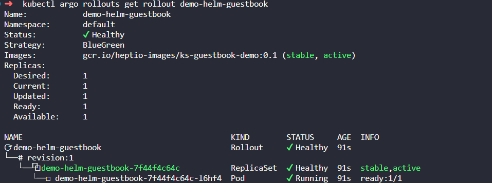
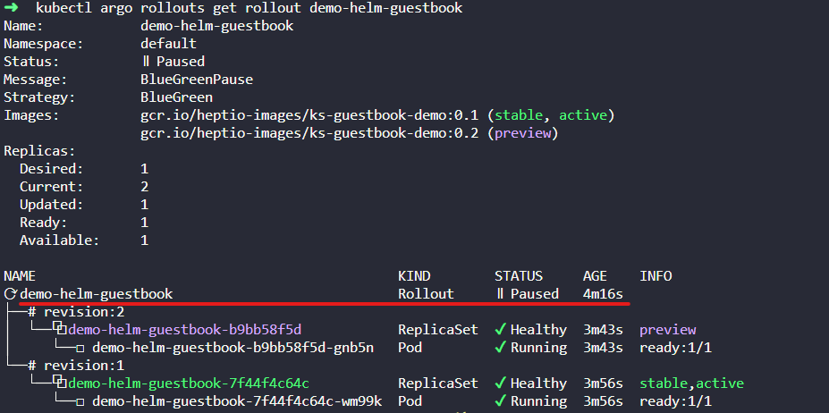
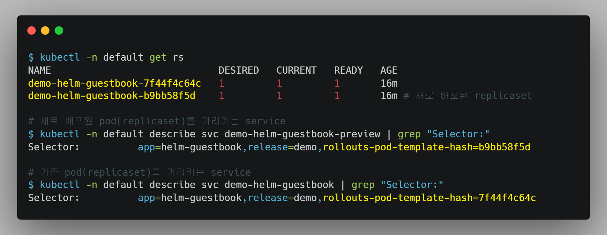
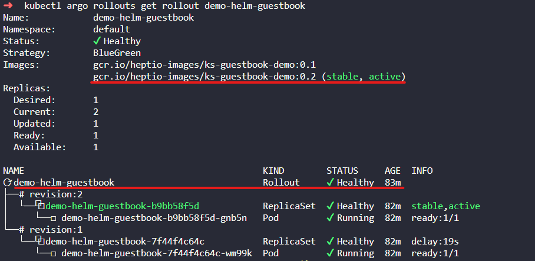

# 개요
* argo rollouts blue/green 예제


# 배포
```bash
kubectl apply -f .
```

# 조회
```bash
kubectl argo rollouts get rollout demo-helm-guestbook
```



# blue/green rollout 예제
* image tag 업그레이드
```bash
kubectl argo rollouts set image demo-helm-guestbook \
  helm-guestbook=gcr.io/heptio-images/ks-guestbook-demo:0.2
```

* argo rollouts 상태 조회
```bash
kubectl argo rollouts get rollout demo-helm-guestbook
```



```bash
kubectl -n default get rs
kubectl -n default get svc
```




* promote
```bash
kubectl argo rollouts promote demo-helm-guestbook
```

* argo rollouts 상태 조회
```bash
kubectl argo rollouts get rollout demo-helm-guestbook
```



# 참고자료
* https://github.com/argoproj/argocd-example-apps
